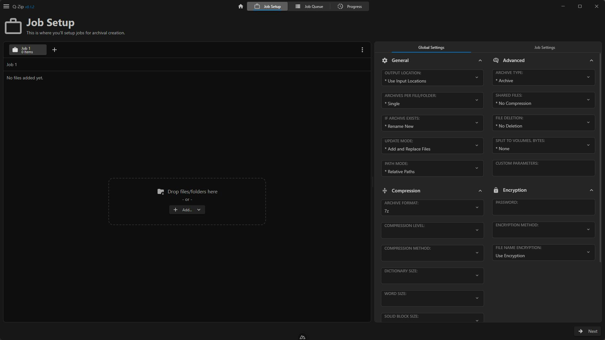

# Q-Zip



**Q-Zip (Queue-Zip)** is a powerful, cross-platform desktop application designed for batch-processing file archives. It provides a robust, job-based workflow that allows users to manage multiple compression tasks with distinct, granular settings for each job, or control them all with a powerful set of global defaults.

Built with a modern tech stack, Q-Zip offers a sleek, responsive user interface for an efficient and intuitive file compression experience.

---

## 🚧 Project Status: Pre-Alpha 🚧

**Please be aware that Q-Zip is currently in a pre-alpha, non-functional state.** It is under active development, and core features are not yet implemented. This repository represents a work-in-progress.

---

## ✨ Key Features

- **Job-Based Workflow:** Organize your compression tasks into separate jobs. Add, remove, reorder, and manage files for each job independently.

- **Powerful Configuration:** Fine-tune every aspect of your archives with a comprehensive set of options, including:

  - **Global & Job-Specific Settings:** Define default settings for all jobs and override them on a per-job basis for ultimate flexibility.

  - **Multiple Archive Formats:** Full support for creating `7z` and `zip` archives.

  - **Advanced Compression Control:** Adjust compression level, method, dictionary size, word size, solid block size, and more.

  - **Encryption:** Secure your archives with password protection and filename encryption.

- **Intuitive File Management:** Easily add files and folders via a file browser or by using the built-in drag-and-drop zone.

- **Modern & Responsive UI:** A clean, dark-themed interface that is easy to navigate and use.

- **Cross-Platform:** Built with Tauri to target Windows, macOS, and Linux. _Currently, development and testing have only been performed on Windows._

---

## 🛠️ Tech Stack

Q-Zip is built with a modern and powerful set of technologies:

- **Core Framework:** [Tauri v2.5](https://tauri.app/) (Rust backend)

- **Frontend Framework:** [Nuxt.js v3.17](https://nuxt.com/) (Vue 3)

- **State Management:** [Pinia](https://pinia.vuejs.org/) with `pinia-plugin-persistedstate`

- **Language:** TypeScript & Rust

- **Styling:** Custom CSS

- **Package Manager:** [pnpm](https://pnpm.io/)

---

## 🚀 Getting Started

To get a local copy up and running for development, follow these simple steps.

### Prerequisites

Before you begin, ensure you have the following installed on your system:

1. **Node.js** (v18 or later recommended)

2. **pnpm** package manager (`npm install -g pnpm`)

3. **Rust & Tauri Prerequisites:** Follow the official Tauri guide for your operating system to set up the necessary Rust toolchain and system dependencies.

   - [Tauri Prerequisites Guide](https://tauri.app/v1/guides/getting-started/prerequisites)

### Development Setup

1. **Clone the repository:**

   ```
   git clone [https://github.com/YourUsername/Q-Zip.git](https://github.com/YourUsername/Q-Zip.git)
   cd Q-Zip
   ```

2. **Install dependencies:**
   This project uses `pnpm`. Run the following command to install all frontend and backend dependencies.

   ```
   pnpm install
   ```

3. **Run the development server:**
   This command will start the Nuxt frontend and launch the Tauri desktop application in development mode with hot-reloading.

   ```
   pnpm tauri dev
   ```

### Building for Production

To create a distributable, production-ready application for your platform, run the following command:

```
pnpm tauri build
```

The compiled application will be located in `src-tauri/target/release/`.

---

## 📜 License

This project is licensed under the **GNU General Public License v3.0**. See the [LICENSE](LICENSE) file for full details.

---

## 🤝 Contributing

Contributions are what make the open-source community such an amazing place to learn, inspire, and create. Any contributions you make are **greatly appreciated**.

If you have a suggestion that would make this better, please fork the repo and create a pull request. You can also simply open an issue with the tag "enhancement".

1. Fork the Project

2. Create your Feature Branch (`git checkout -b feature/AmazingFeature`)

3. Commit your Changes (`git commit -m 'Add some AmazingFeature'`)

4. Push to the Branch (`git push origin feature/AmazingFeature`)

5. Open a Pull Request

Don't forget to give the project a star! Thanks again!
